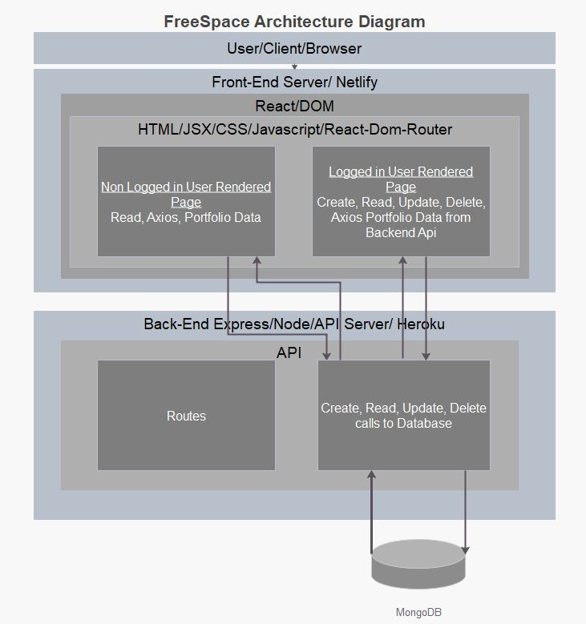

# CA-MERN-Stack-Part-A (Replace with Application Name)

T3A2-A MERN Stack Project Part A | Gabby, Pedro, Luke.

- deployed site
- github repo

#### Purpose

......

#### Functionality / Features

- Create an account with a secure password
- Authentication upon sign in
- Authorisation.
    - Allowing only owners of portfolios to edit and delete their portfolios
    - Allowing only users signed in to make new portfolios
- The ability to create, read, update and delete portfolios
- View everyone's portfolios on the homepage
- Connect with through their portfolio links/buttons
- Filter portfolios by Actors, Artists, Musicians
- Upload many images to portfolio to help with self promotion

#### Target Audience

Artists, Acters, Musicians etc.....

#### Tech stack (e.g. html, css, deployment platform, etc)

Main Stack

- Javascript
- MongoDB
- Express JS
- React
- Node JS
- HTML5 / SCSS
- Bootstrap
- VSCode
- Lucid Chart
- Trello
- more

Modules

- Passport
- AWS cli
- more

Third Party Services

- Netlify/ Heroku/ AWS?
- Github
- AWS S3 Bucket
- Stripe ?

## Dataflow Diagram

- doesnt seem to need a description or anything to meet HD reqs

(image)

<!-- 6.0 to >5.0 pts
HD
Provides dataflow diagram(s) that strictly follow the standard convensions to clearly identify the processes within your application. Clearly depicts where data is coming from, where it is going and how it is being stored. -->

## Application Architecture Diagram

still to do
- i might need to add a description to better the chances of a HD
- different front end instances

<!-- 6.0 to >5.0 pts
HD
Shows almost flawless understanding of the high level structure of the app -->

## Wireframes

Wireframes were built using figma.com and regularly updated to keep up with our agile methodology.

Link to complete wireframes: https://www.figma.com/file/UV2ORPDQHDbOpmktAvAJfv/Untitled?node-id=0%3A1

First draft of wireframes (9am 13th July)

Notes:
- revise industry standard UI/UX
- complete relationships between screens
- focus on  space distribution, content prioritisation, and users intended actions

<!-- 12.0 to >10.0 pts
HD
Provides wireframes that show exceptional planning of project flow and structure including but not limited to space distribution, content prioritisation, intended actions, functions, relationships between screens. -->

## User Stores

MVP User Stories

Users can: 
- Secure Login
- Create an account and portfolio page
- View other portfolios
- Share partfolio with others
- Preview Page before deploying

Sprinkle User Stories

Users can: 
- TBC

<!-- 6.0 to >5.0 pts
HD
Provides multiple user stories that use ‘persona, what and why’ that outline meaningful features of project. Shows evidence of user story revision and refinement. -->

## Project Management

Trello Board Link: https://trello.com/b/vcGGvVN7/mern-stack-assessment

Starting with the planning stage of the project, after thoroughly going over the criteria of the assignment and Rubrik, Our team started with Minimum Viable Product (MVP) ideas. Starting with a Trello board, We split up the assignment's MVP requirements into To-Do cards as well as MVP user stories. The cards include checklists, dates to be completed as well as colour coded labels (red being MVP, most important) to highlight their importance as well as their difficulty/time cost. After the Trello board we set up and layout our Git Repositories adding each of the group users ready for collaborationa and rest of the project. 

MVP Initial Trello board at the start of the project

Our team refer back to the Trello board at least every morning and afternoon, if not every time we finish a tasks. We move cards that we aim to do on that day into the "Doing" column, move cards into the "Done" column when they are complete as well as constantly adding more User Stories and To Dos to their columns to at least aim to complete.

Throughout the day, things that come into mind that will need doing or may cause errors, later on, are noted, commented and even added to the Trello in the appropriate area.

Trello Board End of Planning and Design Stage (Part A)

<!-- trello/ project management
6.0 to >5.0 pts
HD
Simple and clear standards for planning methodology chosen and adhered to -->

<!-- ## zip -r LukeSkywalker_T3A2-A.zip LukeSkywalker_T3A2-A -->

